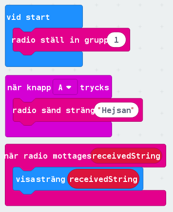
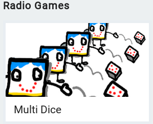
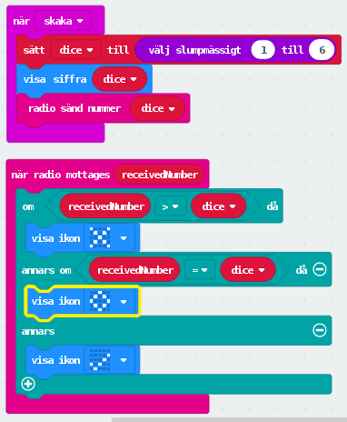

# Lesson 2 - Bluetooth (Radio)
**SWE**
Denna lektion kommer lära dig hur du programmerar microbitens bluethooth modul för att skicka meddelanden till andra microbits med radiosignaler.

**ENG**
This lesson with teach you how to use your microbit's bluetooth module to send messages to other microbits using radio signals.

## Instruktioner (Instructions)
**SWE**
Idag ska vi först skapa ett simpel messenger program som skickar text till en annan microbit som sedan visar upp vårt meddelande. Sedan går vi vidare och följer MakeCode sidans "Självstudier" program "Multi Dice".

1. [Öppna MakeCode i din webbläsare](https://makecode.microbit.org/)
2. Skapa följande kod för att kunna skicka meddelanden till andra microbits i samma radio grupp. 
3. Ladda hem ditt program och för över filen till din microbit map i filhanteraren. Hitta sedan någon att skicka ditt meddelande till. Tänk på att ni måste programmerat in samma radio grupp!
4. Säg till när ni kommer hit så ska vi skicka meddelanden ihop!
5. Vi ska nu skapa ett multiplayer spel! Denna kod har Microsoft själva skapat en bra steg-för-steg guide för som vi ska använda. Gå tillbaks till sidan [MakeCode i din webbläsare](https://makecode.microbit.org/)
6. Scrolla sedan ner och klicka på . Följ sedan instruktionerna steg för steg.
7. När du är klar med stegen klickar du på färdig/finished. Sedan kan du förbättra din kod lite, så att den ser ut så här. 

**ENG**

### Fortsättning
**SWE**
1. 

**ENG**
