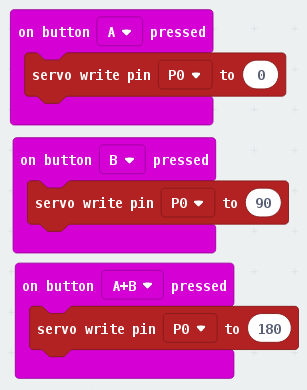
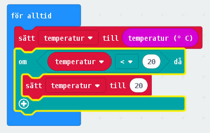
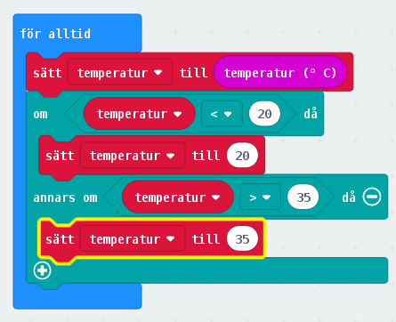
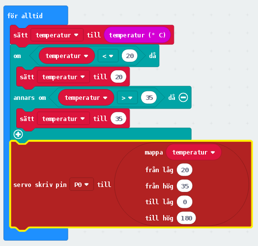
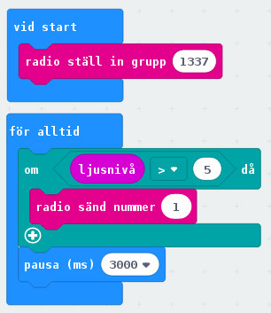
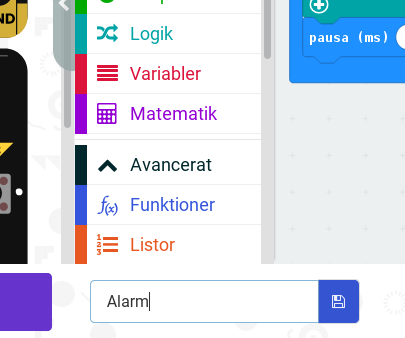
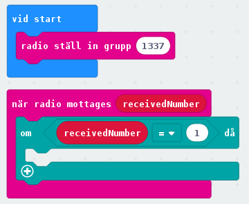
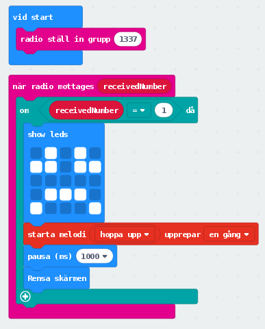

# Lesson 3 - Movement
**SWE**
Idag ska vi lära oss hur vi kan koppla en motor till vår microbit. Motorn kan användas för allt möjligt. Vi börjar med att skapa en termometer som visar hur varmt det är. Sedan, för dem som blir klara, så bygger vi ihop vår "buggy" för att ge hjul till microbiten.

## Instruktioner
Läs noga och fråga om du inte förstår. Se till att försöka själv först.

### Temperaturmätare (Moment 1)
1. Starta ett nytt [MakeCode project](https://makecode.microbit.org/#editor) och gör så vi kan styra vår servo motor som vi kopplar in när du är klar! De röda "servo write pin" blocken hittar du genom att först trycka på "Advanced" i menyn med block, sedan skrolla ner. Så här ska det se ut, 
2. Säg till när du är klar, så kopplar vi på servo motorn och testar din kod!
3. Nu skapar vi ett nytt projekt (eller tar bort koden vi precis gjorde) för att göra vår temperatur mätare.
4. Börja med att skapa en variabel som heter "temperatur" och lägg in den i "För alltid" blocket. Lägg sedan till så koden ser ut så här, . 
5. Du förlänger ditt "om" block genom att trycka på plus tecknet. Gör det två gånger, sedan ta bort den längst ner genom att klicka på minus tecknet längst ner till höger. Så här ska det se ut, 
6. Öppna sedan "Advancerat" blocken igen och hitta kommande block under "Pins" fliken. Här är vår färdiga kod! 
7. Säg till när du är klar så testar vi den!
8. Nu behöver vi papper och pennor/kritor för att skapa vår temperatur mätare som vi sätter på vår motor.

### Tjuvalarm (Moment 2)
1. Detta moment gör vi två och två, eftersom två stycken microbits behövs. En för att larma när tjuven kommer, och den andra för att varna oss att någon försöker stjäla våra saker!
2. Ställ in din radio grupp till något ingen annan grupp har. Koden för den första microbiten ser ut så här, 
3. Döp sedan din kod till t.ex. "Alarm" och spara den. Det kan man smidigt göra genom fältet och knappen längst ner här, 
4. Programmera ena microbiten med din "Alarm" kod fil.
5. Skapa nu ett nytt projekt för koden till den andra microbiten som ska varna oss för tjuven.
6. Börja med att bygga följande kod som gör något när microbiten tar emot "numer 1" från radio gruppen du ställt in. 
7. Bygg sedan ut så att LEDs lyser upp och en melodi spelas när numret tas emot. 
8. Nu ska vi snart testa vårt alarm, men först behöver vi koppla ett batteri till vår "alarm microbit"
9. Dags att stänga in vårt alarm i en plats vi inte vill att någon tjuv kommer in! Sedan sätter vi oss en bit bort vet vetskap om att våra ägodelar är larmade. Sedan får en person leka tjuven :D

### Robot Buggy (Moment 3)
1. När du är klar med de andra två momenten ska vi bygga ihop hjul till vår microbit!
2. Det gör vi tillsammans, så säg till din ledare.
