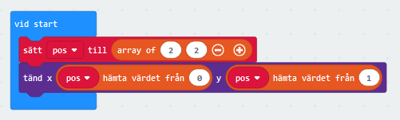
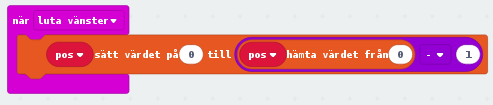
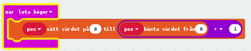
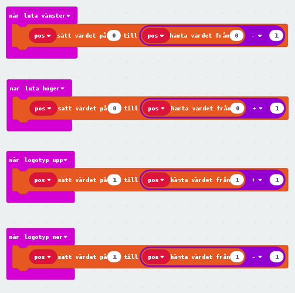
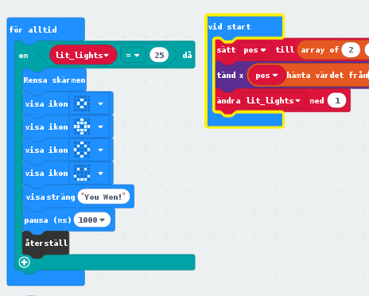
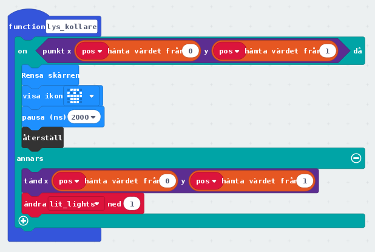
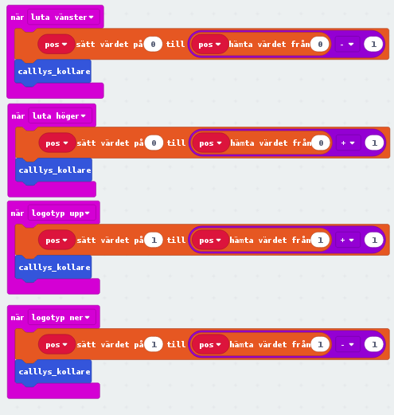
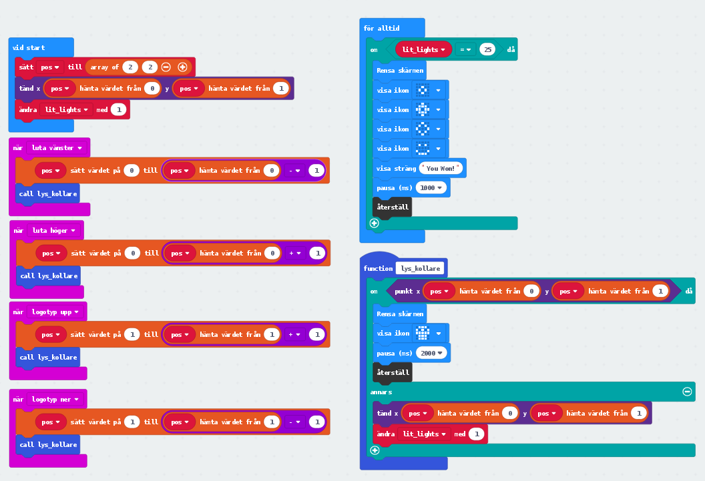

# Lesson 4 - Snakey & Buggy
**SWE**
Idag ska vi skapa ett dataspel, likt snake. Vi gör det genom att använda oss av en lista (arrays).

## Instruktioner
Läs noga och fråga om du inte förstår. Se till att försöka själv först.

### Snakey Spelet
1. Skapa ett nytt projekt i MakeCode.
2. Börja med att skapa en variabel som du döper till **pos** (står för position). Vi sätter sedan vår variabel till en lista (array) som har två värden. Det gör vi för att kunna veta vilken position bland alla LEDs vi är på när vi spelar 
3. Nu ska vi göra så att vi kan flytta ett steg till vänster 
4. Nästa kod är nästan lika dan, för vi ska kunna flytta till höger också 
5. Nu gör vi nästan likadant, för att kunna flytta upp och ner!
6. Din kod ska nu se ut så här! 
7. Nu ska vi göra så man kan vinna också. Vi skapar en till variabel som vi t.ex. döper lit_lights (eller lyser). Sedan gör vi så att vi alltid kollar om alla 25 LED lampor lyser. **Då har man vunnit!** 
8. Med följande kod kollar vi om LED lampan redan lyser vid positionen vi vill flytta till. Om LED lampan redan lyser **så förlorar man spelet** och får börja om. Annars tänder vi lampan och har nu flyttat ett steg. 
9. Nu lägger vi in vår nya funktion så att den körs varje gång vi tar ett steg. 
10.När du är klar ska din kod se ut så här, 

