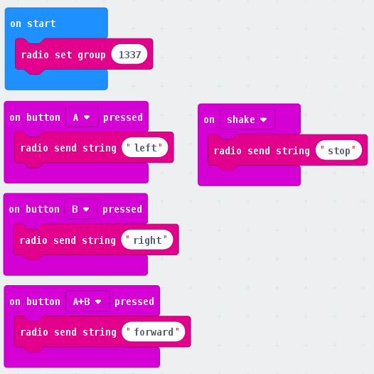

# Lesson 6 - Buggy Robot
**SWE**
Nu ska vi programmera en microbit som fått hjul att köra med tack vare vår buggy!

## Instruktioner
Läs noga och fråga om du inte förstår. Se till att försöka själv först.

Vi kommer skapa två projekt, en för varje microbit vi ska programmera. Den första är vår "remote control", som vi ska använda för att skicka kommandon till vår buggy så vi kan styra den. Sedan skapar vi koden för microbiten som sitter i vår buggy, som tar emot kommandon och får hjulen att snurra.

Först behöver vi ladda hem extra kodpaket för det vi ska göra idag. Dem hittar du i menyn med block under "Avancerat -> Tillägg". Den nya sidan som visar har alla tillägg man kan ladda hem. Klicka på "kitronik-servo-lite", sedan gå in till sidan igen och klicka på "neopixel".

1. Vi kan välja att skicka siffror eller strängar som våra kommandon. I vårt exempel använder vi strängar. Här är koden för vår kontroll 
2. Efter du har sparat koden för kontrollen, så skapar du ett nytt projekt.
3. Minimum kod för att vår buggy ska kunna styra ser ut så här, 
4. Nu kan vi lägga till lite egen kod. Här ger vi vår buggy ett ansikte och visar vart vi kör med våra led lampor. 

5. LED lampor är skoj, men vi har även ett par kraftiga RGB "headlights" som vi kan programmera med "neopixel" koden vi laddat hem!
6. Vi behöver först sätta vår neopixel till en variabel. Den koden finns färdig bland "Neopixel" blocken. Sedan kan vi lägga till att det ska lysa olika färger när vi gör olika saker! 
